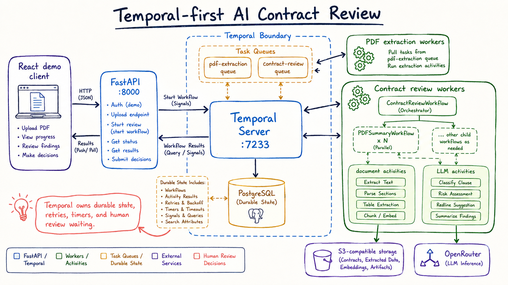
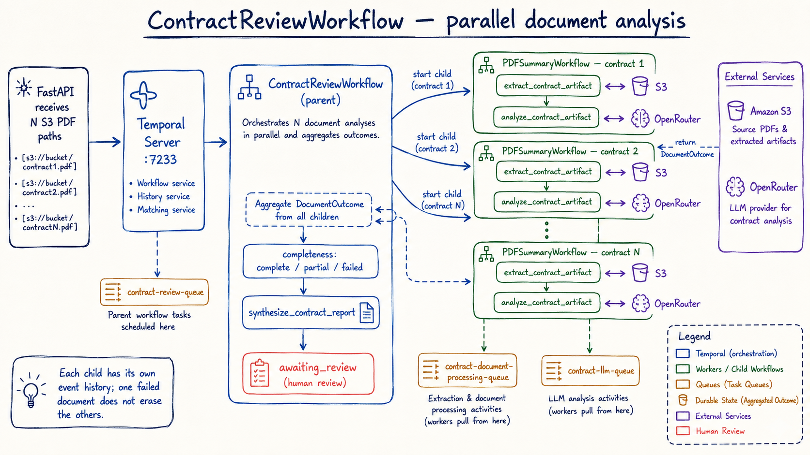
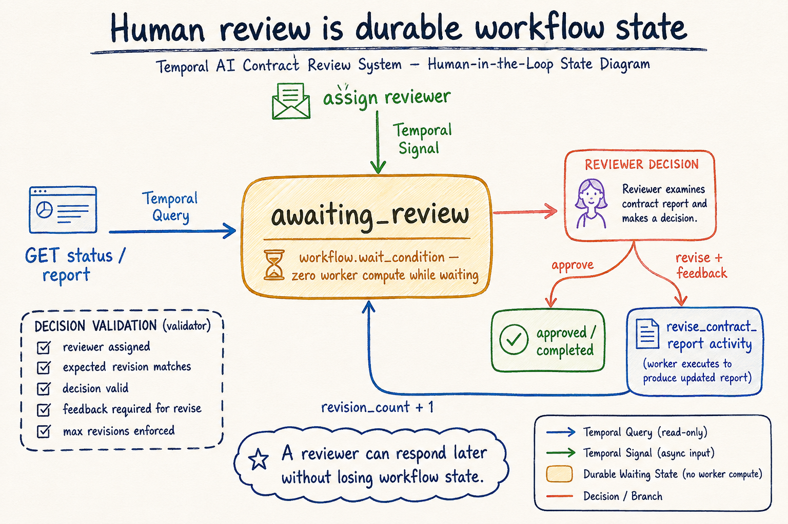
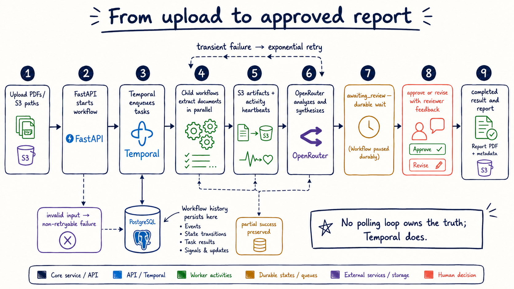

# Temporal-first AI Contract Review

An agentic document-processing system built to demonstrate durable execution with [Temporal](https://temporal.io/), not just a chat interface.

The system accepts PDF contracts, converts them into durable Markdown artifacts, analyzes documents in parallel, synthesizes a risk report with an LLM, and then pauses for a real human decision. A reviewer can approve the report or request a revision without losing workflow state. If a worker, API process, or container restarts, Temporal remains the source of truth for the workflow.

The React application is intentionally a thin demonstration client. The engineering focus is the Temporal architecture behind it: workflow orchestration, child workflows, activity isolation, retries, heartbeats, durable waiting, and human-in-the-loop updates.

## Why this project exists

Long-running AI document jobs are a poor fit for a single HTTP request. A contract review may need to:

- download and process multiple documents;
- call external storage and an LLM provider;
- retry transient failures without duplicating artifacts;
- report progress while work is still running;
- preserve partial document outcomes;
- wait hours or days for a reviewer;
- resume revision work from durable state.

This project treats those requirements as a workflow-design problem. FastAPI starts and observes work, but Temporal owns the execution history and the state transitions.

## What the system demonstrates

| Capability | Implementation | Why it matters |
| --- | --- | --- |
| Durable orchestration | Temporal Python workflows | Progress survives process and container restarts |
| Parallel fan-out | One child workflow per contract PDF | Documents can be processed independently and concurrently |
| Activity isolation | Separate orchestration, document, and LLM workers | Slow or failure-prone integrations do not block workflow tasks |
| Resilience | Retry policies and non-retryable validation errors | Transient failures retry; bad inputs fail clearly |
| Progress visibility | Workflow Queries and activity heartbeats | The API and UI can show meaningful stages without guessing |
| Human-in-the-loop | Temporal Signal and Update handlers | Review decisions are durable workflow events, not ad-hoc flags |
| Agentic synthesis | OpenRouter-backed analysis, synthesis, and revision activities | The LLM is one activity inside a controlled, auditable process |
| Artifact lineage | S3-compatible PDF and Markdown objects with SHA-256 metadata | Results can be traced back to their source documents |
| Operational packaging | Docker Compose health checks and service dependencies | The complete system can be started as one local stack |

## Architecture at a glance

This overview keeps the browser client on the edge and puts Temporal at the center. The important boundary is between deterministic workflow orchestration and side-effecting activities: workers pull tasks from Temporal, while S3 and OpenRouter remain external dependencies.

The diagram above is intentionally text-based so the repository remains readable without a diagram renderer. The full image-generation prompts are included at the end of this README.

## Two workflow paths

### 1. PDF extraction pipeline

The standalone PDF path is useful when a document needs to become a durable Markdown artifact before any contract analysis happens.

~~~text
POST /process_pdf/start
        │
        ▼
PDFPipelineWorkflow on pdf-pipeline-queue
        │
        └── convert_pdf_to_markdown activity
              ├── download source PDF from S3-compatible storage
              ├── extract text with PyMuPDF
              ├── write a derived Markdown object
              └── return output URI, SHA-256, size, and content type
~~~

The workflow has a separate document task queue, uses a bounded retry policy, and refuses unsafe or invalid output keys. The API returns a workflow ID immediately for the start endpoint; the result endpoint reads the completed Temporal result.

### 2. Contract review agent

The contract path is the main agentic workflow. It is a parent workflow with one child workflow per source PDF.

~~~text
POST /contract-review/start
        │
        ▼
ContractReviewWorkflow on contract-review-queue
        │
        ├── start child: PDFSummaryWorkflow(contract 1)
        ├── start child: PDFSummaryWorkflow(contract 2)
        └── start child: PDFSummaryWorkflow(contract N)
                │
                ├── extract_contract_artifact activity
                └── analyze_contract_artifact activity
        │
        └── synthesize_contract_report activity
                │
                ▼
        durable awaiting_review state
                │
        ┌───────┴────────┐
        │                │
     approve          revise(feedback)
        │                │
   completed       revise_contract_report
                         │
                         └── return to awaiting_review
~~~

Each child has its own Temporal history. The parent aggregates successful and failed document outcomes, records whether the report is complete or partial, and then synthesizes the consolidated report.

## Human-in-the-loop design

Human review is modeled as workflow state, not as a web-server session:

1. The parent workflow sets its phase to <code>awaiting_review</code>.
2. <code>workflow.wait_condition</code> suspends execution while consuming no worker compute.
3. The API exposes the current state through a Temporal Query.
4. Reviewer assignment is recorded with a Temporal Signal.
5. Approval or revision is submitted with a validated Temporal Update.
6. The Update validator rejects stale revisions, missing reviewers, invalid decisions, or feedback-free revisions.
7. Approval completes the workflow; revision runs the LLM revision activity and returns to the same durable review state.
8. A configurable maximum revision count prevents an unbounded review loop.

This is the important distinction from a conventional background task: the reviewer can respond much later, while the workflow still has a durable, inspectable state and a complete event history.

## Reliability and failure handling

- Temporal retries transient activity failures with exponential backoff.
- Invalid PDF inputs and unsafe output keys are marked non-retryable so the system does not waste attempts on bad data.
- Long PDF extraction and LLM operations heartbeat progress to Temporal.
- Each document is isolated as a child workflow; one failed document is represented in the report instead of erasing the other results.
- The API has liveness and readiness endpoints and reports Temporal unavailability as a service error.
- S3 artifacts are content-addressed with SHA-256 and are never silently overwritten by a source PDF.
- LLM settings entered through the API are process-local overlays and are not written into Temporal history.
- Docker Compose waits for PostgreSQL, Temporal, and API health before starting dependent services.

## Repository map

~~~text
.
├── compose.yaml
├── README.md
├── apps/
│   ├── client-app/              FastAPI API and S3 artifact/upload services
│   ├── ai-contract-review/      Parent/child workflows and contract activities
│   ├── pdf-extraction/         Standalone PDF workflow and conversion activity
│   └── react-app/              Thin React/Vite demonstration client
└── setup/samples-server/       Temporal development configuration and UI assets
~~~

### Temporal task queues

| Queue | Worker responsibility |
| --- | --- |
| <code>pdf-pipeline-queue</code> | Start and run the standalone PDF workflow |
| <code>pdf-document-processing-queue</code> | Download, extract, and upload PDF Markdown artifacts |
| <code>contract-review-queue</code> | Run the contract parent and PDF child workflow logic |
| <code>contract-document-processing-queue</code> | Extract contract text and durable Markdown artifacts |
| <code>contract-llm-queue</code> | Analyze documents, synthesize reports, and revise reports |

## API surface

| Method | Endpoint | Purpose |
| --- | --- | --- |
| GET | /health | Process liveness |
| GET | /health/live | Container liveness |
| GET | /health/ready | Temporal readiness check |
| POST | /uploads/pdfs | Validate and upload one or more local PDFs |
| POST | /process_pdf/start | Start a standalone PDF workflow |
| GET | /process_pdf/{workflow_id}/status | Query PDF phase and completion state |
| GET | /process_pdf/{workflow_id}/result | Read generated Markdown artifact metadata |
| POST | /contract-review/start | Start a multi-document contract review |
| GET | /contract-review/{workflow_id}/status | Query phases, documents, reviewer, and completeness |
| GET | /contract-review/{workflow_id}/report | Read an in-flight report through a Query |
| GET | /contract-review/{workflow_id}/result | Read a terminal report result |
| POST | /contract-review/{workflow_id}/assign | Signal the reviewer assignment |
| POST | /contract-review/{workflow_id}/decision | Submit an approve/revise Update |
| GET | /artifacts/markdown?uri=... | Preview or download a Markdown artifact |
| GET | /workflows | List PDF and contract workflow executions |
| GET | /settings | Read safe operational settings metadata |
| POST | /settings/llm/test | Probe an LLM provider without storing the key |

## Run locally with Docker Compose

### Prerequisites

- Docker Desktop with Compose v2
- An S3-compatible bucket and credentials
- An OpenRouter-compatible API key and model

### Configure secrets

Copy the example environment files and fill in local values. Never commit real credentials:

~~~powershell
Copy-Item apps/ai-contract-review/.env.example apps/ai-contract-review/.env
Copy-Item apps/pdf-extraction/.env.example apps/pdf-extraction/.env
Copy-Item apps/client-app/.env.example apps/client-app/.env
~~~

The Compose file overrides container-to-container routing with <code>TEMPORAL_HOST=temporal:7233</code>. Keep example files safe to share and put credentials only in ignored <code>.env</code> files or a secret manager.

### Start the stack

~~~powershell
docker compose up --build -d
docker compose ps
~~~

Available local services:

| Service | URL |
| --- | --- |
| Demo client | http://localhost:8501 |
| FastAPI docs | http://localhost:8000/docs |
| FastAPI readiness | http://localhost:8000/health/ready |
| Temporal UI | http://localhost:8080 |
| Temporal gRPC | localhost:7233 |

If the browser shows an older demo client after a frontend change, rebuild the web image explicitly:

~~~powershell
docker compose build web
docker compose up -d web
~~~

This matters because the production web container copies a compiled Vite bundle into Nginx; it does not mount the source tree for live updates.

### Stop the stack

~~~powershell
docker compose down
~~~

The PostgreSQL volume is named <code>temporal-postgresql-data</code> and is retained unless you explicitly remove it.

## Development checks

Frontend type-check and production build:

~~~powershell
Set-Location apps/react-app
npm run build
~~~

The package also exposes an `npm test` script for frontend tests when test files are present. Python services are packaged independently in their own Docker images. Use Compose health checks and Temporal UI to validate the running stack, then exercise the API with the OpenAPI page or the demo client.

## Portfolio takeaways

This project is a practical example of:

- choosing a workflow engine for AI tasks that outlive a request/response cycle;
- separating deterministic orchestration from side-effecting activities;
- scaling document work with child workflows instead of one large history;
- using Temporal Queries, Signals, and Updates as explicit application contracts;
- designing human review as a durable state transition;
- making partial success and retry behavior visible to the user;
- packaging API, workers, Temporal, PostgreSQL, and the demo client as one reproducible stack.

### LinkedIn-ready summary

> Built a Temporal-first AI contract review platform in Python. The system fans out multi-document PDF processing into durable child workflows, uses heartbeating and retryable activities for S3 and LLM integrations, synthesizes a consolidated risk report, and pauses safely for human approval or revision through Temporal Updates. FastAPI exposes the workflow API, Docker Compose packages the stack, and React provides a lightweight demonstration client.

## Demo video

Add your walkthrough recording at <code>assets/temporal-contract-review-demo.mp4</code> and link it here:

[Watch the complete Temporal workflow demo](assets/temporal-contract-review-demo.mp4)

For the strongest portfolio story, record a short sequence that shows:

1. uploading two PDFs;
2. the API returning a workflow ID immediately;
3. Temporal workers processing child workflows in parallel;
4. document progress and generated Markdown artifacts;
5. LLM report synthesis;
6. the workflow waiting for human review;
7. a reviewer assigning themselves and requesting a revision;
8. the revised report returning to review;
9. final approval and the durable completed result.

## Architecture diagrams

The following diagrams are generated in a consistent hand-drawn Excalidraw/Miro workshop style. They are intentionally split by concept so a reader can understand the system progressively instead of decoding one overloaded poster.

### Parent workflow and parallel child workflows

The parent starts one PDFSummaryWorkflow child per source PDF. Each child extracts and analyzes one document, then returns a DocumentOutcome. The parent can preserve partial success, aggregate findings, and continue to report synthesis even when an individual document fails.

### Human-in-the-loop review state

Human review is a durable Temporal state. Queries read the report, Signals assign the reviewer, and an Update validates approve or revise decisions. Revision work returns to the same waiting state, so a reviewer can respond later without a server session or a custom polling process owning the truth.

### End-to-end lifecycle and reliability

This lifecycle shows the complete story: upload, workflow start, queue dispatch, parallel extraction, artifact and heartbeat progress, LLM synthesis, durable waiting, human decision, and completion. It also shows the reliability branches for exponential retries, non-retryable invalid input, PostgreSQL workflow history, and preserved partial success.

All images live under <code>assets/diagrams/</code> so they can be replaced with higher-resolution exports later without changing the README structure.
